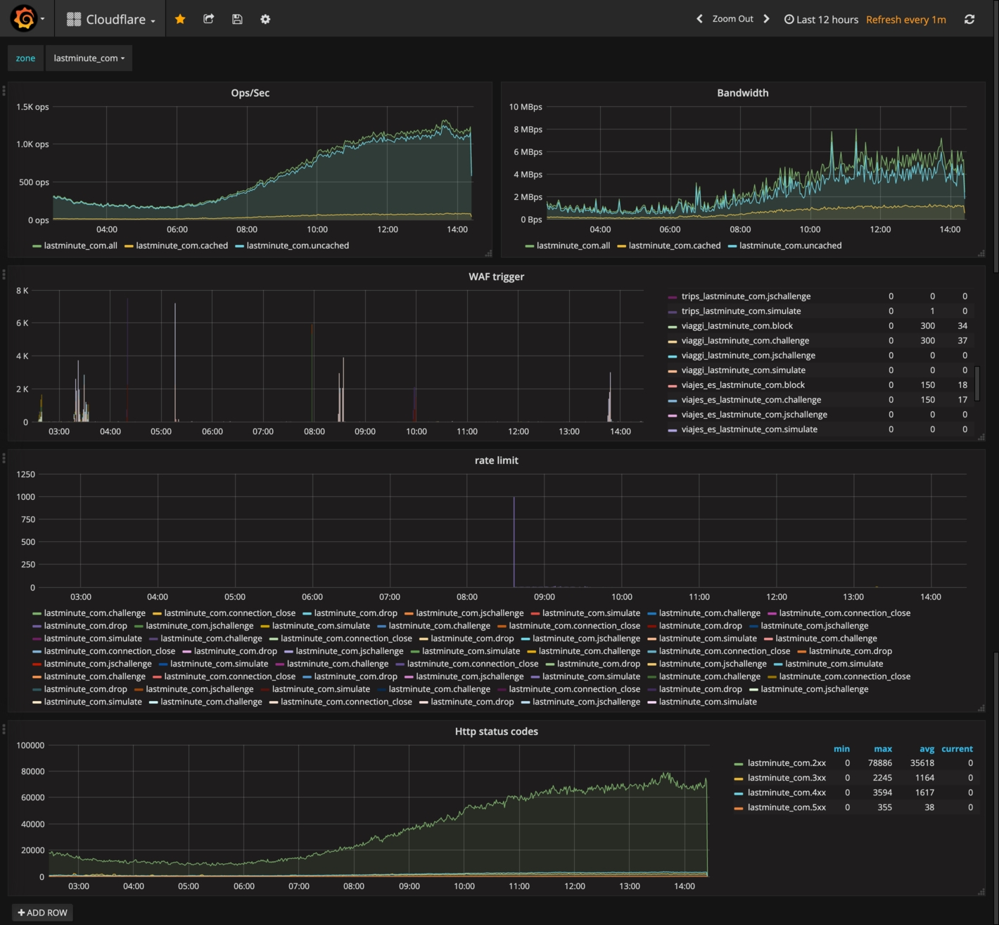

# Heimdall
Heimdall, all-seeing and all-hearing

## General behaviour
**_Heimdall_** is a scheduler application based on cron and http calls to Cloudflare's API.

Setting your organizationId, **_Heimdall_** retrieve all the zones configured in you account and get the metrics to collect.
 
## Setting up the environment

#### Environment variables
```bash
export CLOUDFLARE_ORG_ID=<YOUR ORGANIZATION ID>\
export CLOUDFLARE_EMAIL=<YOUR EMAIL>\  
export CLOUDFLARE_TOKEN=<YOUR TOKEN>\
export CONFIG_PATH=<CONFIGURATION FILE PATH>
```
this variables are required for the correct working of *Heimdall*

#### Configuration file [configuration example](./example/config.json)
```json
{
  "collect_every_minutes" : "5",
  "graphite_config": {
    "host": "graphite.company.com",
    "port": 2113
  }
}
```
collect_every_minutes: mean that the metrics will be taken every interval defined. 

eg.: 5 meaning: every 5th minute for the last 5 minute

graphite_config: is the configuration required to connect to your graphite host in order to push the metrics.

## Setting up in kubernetes

Create the secrets as specified deployment file [deployment example](./kubernetes/deployment.yaml)

#### Configuration file [configuration example](./example/config_k8s.json)
```json
{
  "collect_every_minutes" : "5",
  "graphite_config": {
    "host": "graphite.company.com",
    "port": 2113
  },
  "kubernetes": {
    "management_port": "8888"
  }
}
```
kubernetes is used to expose management ports used by liveness and readiness probes.

## How to contribute to Heimdall

#### Did you find a bug?

* Ensure the bug was not already reported by searching on GitHub under [Heimdall board](https://github.com/lastminutedotcom/heimdall/issues).
* If you're unable to find an open issue addressing the problem, open a new one. Be sure to include a **title and clear description**, as much relevant information as possible, and a **code sample** or an **executable test case** demonstrating the expected behavior that is not occurring.

#### Did you write a patch that fixes a bug?

* Open a new GitHub pull request with the patch.
* Ensure the PR description clearly describes the problem and solution. Include the relevant issue number if applicable.

#### Do you intend to add a new feature or change an existing one?

* Suggest your change opening an issue on [Heimdall board](https://github.com/lastminutedotcom/heimdall/issues).

#### Do you have questions about the source code?

* Ask any question about how to use Heimdall on [Heimdall board](https://github.com/lastminutedotcom/heimdall/issues).

## Grafana



This is an example of dashboard created using the data collected with **Heimdall**.
 
You can find the dashboard configuration at the following link [cloudflare-dashboard.json](./grafana/cloudflare-dashboard.json). 